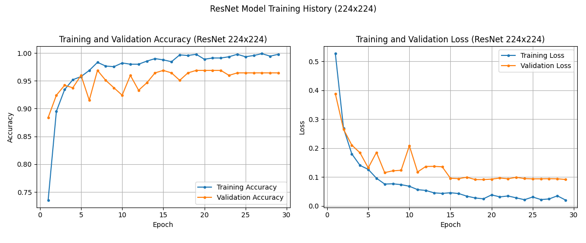
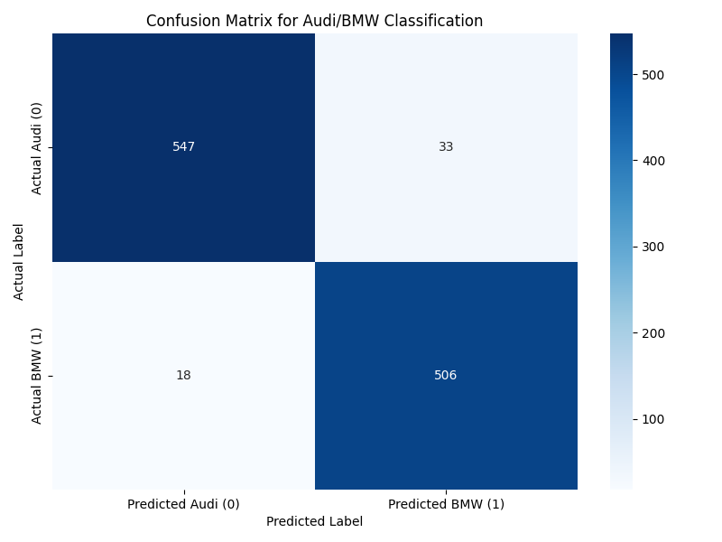
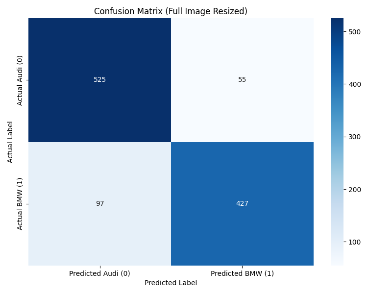

# Audi vs. BMW Image Classification using ResNet50

## Project Overview

This project implements and trains a deep learning model to classify images of cars as either Audi or BMW. It utilizes transfer learning with a pre-trained ResNet50 model and incorporates bounding box information for more focused image cropping during preprocessing.

## Dataset

-   **Source:** [Stanford Cars Dataset](https://web.archive.org/web/20200315211720/https://ai.stanford.edu/~jkrause/cars/car_dataset.html)
-   **Filtering:** The dataset is filtered to include only specific classes corresponding to various Audi and BMW models (classes 12-38).
-   **Labels:** Images are assigned binary labels: 0 for Audi (classes 12-25) and 1 for BMW (classes 26-38).
-   **Bounding Boxes:** Bounding box coordinates provided in the dataset are used to crop the images, focusing the model's attention on the car itself before resizing and further processing.

Citation:<br>
**3D Object Representations for Fine-Grained Categorization** <br>
Jonathan Krause, Michael Stark, Jia Deng, Li Fei-Fei<br>
*4th IEEE Workshop on 3D Representation and Recognition, at ICCV 2013* **(3dRR-13)**. Sydney, Australia. Dec. 8, 2013.

## Model Architecture

-   **Base Model:** ResNet50 pre-trained on ImageNet, used as a feature extractor (final classification layer removed). The base model's weights are initially frozen.
-   **Pooling:** `GlobalAveragePooling2D` layer to flatten the features from the ResNet50 base.
-   **Custom Head:** Two dense blocks are added:
    1.  Dense (128 units) -> Batch Normalization -> ReLU Activation -> Dropout
    2.  Dense (64 units) -> Batch Normalization -> ReLU Activation -> Dropout
-   **Output Layer:** A final Dense layer with 1 unit and a `sigmoid` activation function for binary probability output.

## Preprocessing

Input images undergo the following preprocessing steps:
1.  Loading the image file.
2.  Cropping the image using the provided bounding box coordinates.
3.  Resizing the cropped image to 224x224 pixels.
4.  Applying data augmentation during training (rotation, shifting, shearing, zooming, flipping, brightness adjustment).
5.  Applying ResNet50-specific preprocessing (mean subtraction, scaling via `tf.keras.applications.resnet50.preprocess_input`).

## Training

The model is trained using the Adam optimizer and binary cross-entropy loss. Callbacks are used for:
-   **Early Stopping:** To stop training if validation loss doesn't improve.
-   **ReduceLROnPlateau:** To decrease the learning rate when validation loss plateaus.
-   **ModelCheckpoint:** To save the best performing model based on validation loss.

### Training History

The following plot shows the training and validation accuracy and loss over epochs for one of the training runs:



*Observations: The model achieves high training accuracy (approaching 100%) and high validation accuracy (peaking around 96-97%). The gap indicates some overfitting, but validation performance remains strong.*

## Evaluation

The best saved model is evaluated on a separate test set (also filtered and preprocessed similarly).

### Confusion Matrix

The confusion matrix below visualizes the model's performance on the test set with images cropped to bounding boxes:



The confusion matrix below visualizes the model's performance on the test set with full, uncropped images:



*Observations: The confusion matrix details the True Positives, True Negatives, False Positives, and False Negatives, providing insight into the types of errors the model makes. Overall test set performance (e.g., accuracy, precision, recall) should be checked from the classification report generated by the evaluation script.*

## Usage

### Prerequisites

-   Python 3.x
-   TensorFlow
-   Pandas
-   Scikit-learn
-   Pillow (PIL Fork)
-   Matplotlib
-   Seaborn
-   openpyxl (for reading Excel files)

You can install dependencies using pip (not tested):
```bash
pip install tensorflow pandas scikit-learn Pillow matplotlib seaborn openpyxl
```

### Classify Your Own Images

```bash
$ python3 classify.py /folder/image_you_want_to_classify.jpg
```

Example:

```bash
$ python3 classify.py pUCGMbdP-2.ykqfdlk028.jpg
[WARNING/CUDA MESSAGES OMITTED]
Model 'audi_bmw_resnet_final_224.keras' loaded successfully.
Loading image from: pUCGMbdP-2.ykqfdlk028.jpg
Image 'pUCGMbdP-2.ykqfdlk028.jpg' loaded and preprocessed.
1/1 ━━━━━━━━━━━━━━━━━━━━ 1s 1s/step
Raw prediction output: [[0.9989589]]
New output: [1]
Prediction: BMW (Confidence: 99.90%)
```

